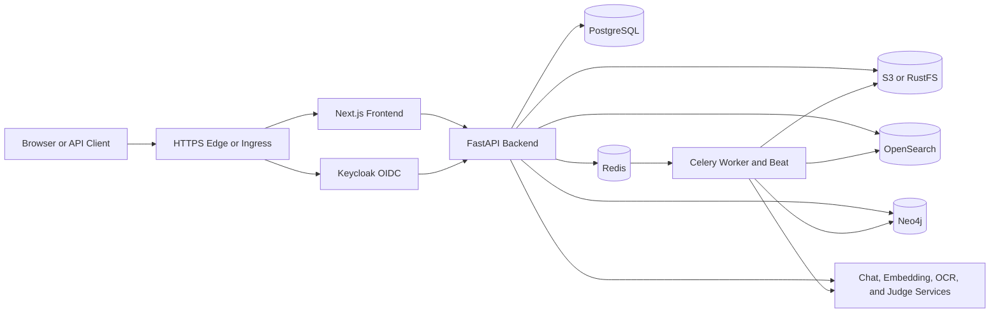

# NomoSmart

[English](README.md) | 繁體中文

NomoSmart 是企業知識管理平台，提供組織知識的匯入、治理、發布、搜尋與驗證能力。

## 1. 專案概述

NomoSmart 將檔案與連接的資料來源轉換為具版本管理的知識。內容依序經過解析、OCR、Markdown 正規化、結構感知切片、標籤、Embedding、審核、發布、搜尋、圖譜探索與具來源引用的對話流程。

平台適用於知識 Owner、Editor、Reviewer、系統管理員、整合開發者與業務使用者。PostgreSQL 保存具權威性的應用程式資料；Redis 與 Celery 協調背景作業；S3 相容 Object Storage 保存原始檔與產出物；OpenSearch 提供 Keyword、Vector 與 Hybrid Retrieval；Neo4j 保存圖譜關係；Keycloak 提供 OIDC 身分認證與企業目錄整合。

產品行為與驗收條件定義於 [SPECIFICATION.md](SPECIFICATION.md)。

## 2. 核心功能

- **多來源知識匯入** — 匯入 PDF、DOCX、TXT 與 Markdown 檔案，並連接 FTP、FTPS、SFTP、S3 與 HTTP API 資料來源。
- **文件處理** — 解析文件、依設定執行 OCR、產生標準 Markdown、建立結構感知切片、套用標籤並建立 Embedding。
- **知識版本管理** — 管理來源檔案、文件版本、顯示內容、切片、標籤、引用關係與目前發布狀態。
- **審核與發布治理** — 將知識送入多階段審核、保存不可變的簽核證據，並發布已核准版本。
- **搜尋與來源引用回答** — 提供 Keyword、Vector 與 Hybrid Retrieval，回答保留文件、版本與切片 Citation。
- **知識圖譜** — 透過具權限範圍的圖譜 View 與 API 呈現專案、文件、切片與標籤關係。
- **品質驗證** — 提供單筆回答回饋、CSV 批次驗證、重試歷程與結果匯出。
- **管理與整合** — 管理專案、使用者、本機角色、權限矩陣、企業目錄映射、模型服務、System Prompt、Integration Client、報表與 Audit Record。
- **雙語介面** — 提供繁體中文與英文使用者介面。

## 3. 系統架構



Migration 與 Deployment Bootstrap Job 會在應用程式進入 Ready 狀態前初始化 Database Schema 與必要 Runtime Record。Readiness Endpoint 會檢查 PostgreSQL、Redis、Object Storage、OpenSearch、Neo4j、Migration 狀態與 Bootstrap Evidence。

## 4. 技術架構

| Layer | Technology | Purpose |
| --- | --- | --- |
| Frontend | Next.js 16.2.12、React 19.2.3、TypeScript 5 | Web Application、OIDC Flow 與 Backend Proxy |
| Backend | Python 3.12、FastAPI、SQLAlchemy、Pydantic | REST API、設定、Domain Logic 與 Persistence |
| Background Processing | Celery 5.5+、Redis 7.4 | 匯入、同步、驗證與排程工作 |
| Database | PostgreSQL 18.4、Flyway 13.0.0 | 權威資料與 Forward-only Migration |
| Object Storage | S3 相容儲存；Bundled 部署使用 RustFS | 原始文件與產出物 |
| Search | OpenSearch 2.19 | Keyword、Vector、Hybrid 與 Staging Index |
| Graph | Neo4j 5.26 Community | 知識關係與 Traversal |
| Identity | Keycloak 26.0.8、OIDC、LDAP/AD Federation | 認證、目錄同步與角色映射 |
| Deployment | Docker Compose v2、Helm Chart 0.8.0 | 單機與 Kubernetes 部署 |
| Verification | Pytest、Vitest、Playwright、Repository Harness | Application、Integration、Deployment 與 Governance Check |

## 5. 專案結構

```text
Nomosmart/
├── frontend/                  Next.js Application、UI Component、i18n 與 Test
├── backend/                   FastAPI API、Worker、Domain Service 與 Test
├── sql/migrations/            Flyway Migration V001 至 V047
├── deploy/docker/             Docker Compose Runtime 設定
├── deploy/helm/nomosmart/     Helm Chart 與各環境 Values
├── deploy/installer/          支援 Profile 的 Kubernetes Installer
├── deploy/package/            Secret 與 TLS Package 生命週期工具
├── deploy/release/            Signed Release Package 工具
├── HARNESS/                   Repository 驗證入口
├── docs/                      Decision、Release Baseline 與 Runbook
├── SPECIFICATION.md           產品與驗收基準
├── TEST_PLAN.md               Test Strategy 與 Verification Record
├── TRACEABILITY.md            Requirement-to-test Traceability
└── docker-compose.yml         單機 Deployment Model
```

## 6. 開始使用

### 6.1 選擇安裝方法

選擇一種方法，並依序完成前置條件、安裝、設定與驗證。

| 方法 | 適用環境 | 安裝元件 |
| --- | --- | --- |
| [方法一：Docker Compose](#method-1-docker-compose) | Workstation 或單一主機 | NomoSmart、PostgreSQL、Redis、RustFS、OpenSearch、Neo4j 與 Keycloak |
| [方法二：Kubernetes bundled](#method-2-kubernetes-bundled) | 由 NomoSmart 管理相依服務的 Kubernetes | NomoSmart 與支援的周邊服務 |
| [方法三：Kubernetes external services](#method-3-kubernetes-external-services) | 由 Operator 管理相依服務的 Kubernetes | NomoSmart Application Workload 與初始化 Job |
| [方法四：Source Development](#method-4-source-development) | 工程開發環境 | Frontend、Backend、Worker 與 Beat，連接已設定的服務 |

新的 Kubernetes 安裝須明確選擇 `bundled` 或 `external-services` Profile。Helm 的 `auto` 值保留供既有部署相容使用。

### 6.2 前置條件

只有 Repository 已定義的項目列出版本基準。

| Requirement | Version 或 Baseline | 適用方法 | 驗證方式 |
| --- | --- | --- | --- |
| Git | 與 Repository 相容的版本 | Docker Compose、Source Development | `git --version` |
| Docker Engine 或 Docker Desktop | 支援 Compose 的安裝版本 | Docker Compose、本機 Flyway | `docker version` |
| Docker Compose | v2 | Docker Compose | `docker compose version` |
| Python | 部署工具使用 Python 3；Backend Development 固定 Python 3.12 | Package Tool、Installer、Backend | `python3 --version` |
| Node.js 與 npm | Container Baseline 為 Node.js 24 | Frontend Development | `node --version` 與 `npm --version` |
| uv | 可使用 Lockfile 的版本 | Backend Development | `uv --version` |
| kubectl | 1.28 以上 | Kubernetes | `kubectl version --client` |
| Helm | v3 或 v4 | Kubernetes | `helm version` |
| OpenSSL | 可用的 CLI | TLS Package、Kubernetes Installer | `openssl version` |
| GnuPG | 可用的 CLI | Signed Release 驗證 | `gpg --version` |
| curl | 支援 HTTPS | Runtime 驗證 | `curl --version` |
| lsof 與 `/etc/hosts` 存取權限 | Unix-like 主機工具 | Docker Compose Preflight | `lsof -v` |

Kubernetes Production 安裝需要至少三個 Ready 且可排程的 Node、符合 Production Plan 的容量、IngressClass、核准的 Longhorn StorageClass、Public DNS、可信任 TLS Material、Registry 存取權限，以及企業目錄或已設定完成的 Keycloak Identity Provider。

### 6.3 Port 與 Endpoint

| Mode | Port 或 URL | 用途 |
| --- | --- | --- |
| Docker Compose | `127.0.0.1:80` | HTTP Redirect 與 Edge Health |
| Docker Compose | `127.0.0.1:443` | HTTPS Application 入口 |
| Source Frontend | `127.0.0.1:3000` | Next.js Development Server |
| Source Backend | `127.0.0.1:8000` | FastAPI、OpenAPI 與 Swagger UI |
| Source Dependencies | `5432`、`6379`、`9000`、`9200`、`7687`、`8080` | PostgreSQL、Redis、S3、OpenSearch、Neo4j 與 Keycloak |
| Kubernetes | `https://<public-host>` | 由 Ingress 管理的 Application 與 OIDC 入口 |

Compose 預設將 Dependency Port 保留在私有 Network 內。`debug` Profile 可將指定 Dependency Port 發布到 Loopback，供工程診斷使用。

<a id="method-1-docker-compose"></a>

## 7. 方法一：Docker Compose

Docker Compose 提供完整的單機使用體驗。安裝流程會 Build Application Image、啟動 Bundled Service、套用 Migration、執行 Deployment Bootstrap，並提供單一 HTTPS Origin。

### 7.1 取得 Source Code

Clone Repository 並進入根目錄：

```bash
git clone https://github.com/crispkid/Nomosmart.git
cd Nomosmart
git status --short
```

受控安裝可選定已核准的完整 Commit SHA：

```bash
git fetch --tags
git checkout --detach "<approved-git-commit>"
git rev-parse HEAD
```

最後顯示的 SHA 必須與核准版本一致。

### 7.2 驗證主機工具

```bash
docker version
docker compose version
python3 --version
openssl version
lsof -v
```

`docker version` 應顯示 Client 與 Server 資訊。Server 區段尚未顯示時，啟動 Docker Engine 或 Docker Desktop 後重新執行。

### 7.3 準備本機 Hostname 與 Port

本機 Package 使用 `https://nomosmart.local`。先檢查 Host Mapping：

```bash
grep -n "nomosmart.local" /etc/hosts
```

找不到對應項目時，新增一筆：

```bash
echo "127.0.0.1 nomosmart.local" | sudo tee -a /etc/hosts
```

保留唯一一筆設定：

```text
127.0.0.1 nomosmart.local
```

確認 Public Port 可使用：

```bash
lsof -nP -iTCP:80 -sTCP:LISTEN
lsof -nP -iTCP:443 -sTCP:LISTEN
```

沒有輸出表示 Port 可使用。出現 Process 時，停止該 Process 後重新檢查。

### 7.4 產生本機設定、Secret 與 TLS Package

Package 指令會建立 Git 忽略的 `deploy/docker/nomosmart.env`，以及 `deploy/docker/generated/current/` 下只允許 Owner 存取的檔案。Local Factory Profile 提供可重現的首次使用環境。

```bash
./deploy/package/nomosmart-package init \
  --target compose \
  --profile factory_acceptance \
  --app-env development \
  --public-host nomosmart.local \
  --no-display
```

驗證 Package：

```bash
./deploy/package/nomosmart-package status --target compose
test -f deploy/docker/nomosmart.env
test -f deploy/docker/generated/current/manifest.json
test -f deploy/docker/generated/current/tls/active/edge-ca.crt
```

每個指令都應回傳狀態 `0`。Production Package 使用 `--profile production`、核准的 Public Hostname、企業 TLS Input，以及必要的 Break-glass Runbook 與 Alerting Evidence。

### 7.5 執行 Preflight 與設定檢查

```bash
./deploy/package/nomosmart-package preflight --runtime compose
./HARNESS/harness.sh docker:config
./HARNESS/harness.sh deploy:config-policy
```

Preflight 會確認 Host Mapping、80 與 443 Port，以及本機 Runtime 邊界。Harness 會驗證 Compose Model 與外部化設定政策。

### 7.6 Build 並啟動平台

```bash
docker compose --env-file deploy/docker/nomosmart.env up -d --build
docker compose --env-file deploy/docker/nomosmart.env ps
```

部署會啟動 PostgreSQL、Migration、RustFS、Redis、Neo4j、OpenSearch、Keycloak、Deployment Bootstrap、Backend、Worker、Beat、Frontend 與 HTTPS Edge。長時間執行的 Service 應顯示 `running` 或 `healthy`；Migration 與 Bootstrap Service 可顯示已成功完成。

### 7.7 驗證 HTTPS、Health 與 Readiness

```bash
curl --fail --silent --show-error \
  --cacert deploy/docker/generated/current/tls/active/edge-ca.crt \
  https://nomosmart.local/edge-health
curl --fail --silent --show-error \
  --cacert deploy/docker/generated/current/tls/active/edge-ca.crt \
  https://nomosmart.local/api/backend/health
curl --fail --silent --show-error \
  --cacert deploy/docker/generated/current/tls/active/edge-ca.crt \
  https://nomosmart.local/api/backend/ready
```

Edge 與 Process Health 的預期結果：

```text
ready
{"status":"healthy"}
```

Readiness 成功時，Response 會包含 `"status":"ready"` 與 Healthy Dependency。Readiness 尚在準備時，保留已產生的設定，並從第一個未完成的 Dependency 開始檢查。

### 7.8 完成首次設定

將 `deploy/docker/generated/current/tls/active/edge-ca.crt` 匯入 Workstation 或 Browser Trust Store，然後開啟：

```text
https://nomosmart.local
```

Factory Profile 會建立首次使用的暫時管理帳號 `nomosmart`，密碼為 `nomosmart`。登入後完成必要的密碼更新，再重新登入。

進入 **系統管理 → 模型**：

1. 建立並測試 Active Embedding Model。
2. 建立並測試 Active Chat Model。
3. 將 Chat Model 連結到至少一個 Active Embedding Model。
4. 使用對應流程時，設定 OCR 與 Judge Model。
5. 設定必要的 Default Model。

建立專案、匯入支援的文件、執行 Extraction、送審並發布版本，最後確認對話結果包含來源 Citation。

### 7.9 操作與停止部署

```bash
docker compose --env-file deploy/docker/nomosmart.env logs --tail=200 backend
docker compose --env-file deploy/docker/nomosmart.env restart backend celery-worker celery-beat
docker compose --env-file deploy/docker/nomosmart.env down
```

`down` 會停止 Container 並移除 Compose Network，同時保留 Named Volume。

<a id="method-2-kubernetes-bundled"></a>

## 8. 方法二：Kubernetes `bundled`

`bundled` Profile 會在同一個受管理的 Release 中安裝 NomoSmart、PostgreSQL、Redis、RustFS、OpenSearch、Neo4j 與 Keycloak。平台 Operator 負責提供 Cluster、IngressClass、StorageClass、DNS、Registry 存取、TLS Material、容量與 Directory Service。

### 8.1 定義安裝值

使用 Release Package 或 Installer 前，先定義所有值：

```bash
export NOMOSMART_RELEASE_DIR="/absolute/path/to/extracted-nomosmart-release"
export NOMOSMART_SIGNER_FINGERPRINT="<trusted-40-to-64-character-openpgp-fingerprint>"
export NOMOSMART_SECURE_ROOT="/secure/nomosmart"
export NOMOSMART_INSTALL_CONFIG="$NOMOSMART_SECURE_ROOT/install.toml"
export NOMOSMART_KUBE_CONTEXT="<approved-kube-context>"
export NOMOSMART_NAMESPACE="nomosmart"
export NOMOSMART_PUBLIC_URL="https://<public-host>"
```

Signer Fingerprint 必須透過獨立的可信任管道取得。安裝與 Resume 期間，已解壓的 Release Package 應固定保存在相同的絕對路徑，並維持不可變更。

### 8.2 驗證 Signed Release Package

```bash
"$NOMOSMART_RELEASE_DIR/deploy/release/nomosmart-release" verify-package \
  --package "$NOMOSMART_RELEASE_DIR" \
  --trusted-fingerprint "$NOMOSMART_SIGNER_FINGERPRINT"
```

驗證成功會回傳狀態 `0`，並在 Installer 連線至 Kubernetes 前確認 Signed Closed Inventory。

### 8.3 驗證工具與 Target Identity

```bash
kubectl version --client
helm version
python3 --version
openssl version
gpg --version
kubectl --context "$NOMOSMART_KUBE_CONTEXT" config view --minify \
  -o jsonpath='{.clusters[0].cluster.server}'
kubectl --context "$NOMOSMART_KUBE_CONTEXT" get namespace kube-system \
  -o jsonpath='{.metadata.uid}'
```

記錄 API Server 與 `kube-system` Namespace UID。兩個值必須與核准的 Target Inventory 及 Installer TOML 一致。

### 8.4 準備受保護目錄與 TLS Material

建立 Mode `0700` 的 Operator-owned Directory：

```bash
install -d -m 0700 "$NOMOSMART_SECURE_ROOT"
install -d -m 0700 "$NOMOSMART_SECURE_ROOT/package"
install -d -m 0700 "$NOMOSMART_SECURE_ROOT/installer-state"
install -d -m 0700 "$NOMOSMART_SECURE_ROOT/tls"
install -d -m 0700 "$NOMOSMART_SECURE_ROOT/inputs"
```

Bundled TLS Directory 需包含核准的 Edge、PostgreSQL Server 與 Replication、Redis、RustFS、OpenSearch HTTP 與 OpenSearch Transport Certificate Set。Private Key 使用 Mode `0600`。Certificate SAN 必須符合 Release、Namespace 與產生的 Service Name。

### 8.5 初始化並完成 Bundled 設定

```bash
cd "$NOMOSMART_RELEASE_DIR"
./deploy/installer/nomosmart-one-click \
  --profile bundled \
  --config "$NOMOSMART_INSTALL_CONFIG" \
  --init-config
```

指令會建立新的 Mode `0600` TOML、保留既有路徑，並將 Chart 與 Values 路徑固定至已驗證的 Package。

編輯檔案並完成下列區段：

| TOML Group | 必要設定 |
| --- | --- |
| Root 與 `release` | `api_version = "install.nomosmart.io/v1alpha2"`、Immutable Package Path 與獨立取得的 Signer Fingerprint |
| `target` | Exact Context、API Server、Cluster UID、Namespace 與 Helm Release |
| `application` | Public Host、Ingress Identity、StorageClass、受保護目錄、Secret 名稱、Onboarding CIDR、Runbook URI 與 Alerting Evidence |
| `images` | 九個 Image，格式固定為 `repository:tag@sha256:<digest>` |
| `identity` | Directory Mode、Realm、Provider、Mapper、Administrator、External Group、Local Role、LDAPS 欄位、Bind Secret 與 CA Secret |

確認受保護檔案權限：

```bash
stat "$NOMOSMART_INSTALL_CONFIG"
```

### 8.6 準備 Namespace 與 Operator Input

先檢查 Namespace：

```bash
kubectl --context "$NOMOSMART_KUBE_CONTEXT" get namespace "$NOMOSMART_NAMESPACE"
```

Namespace 尚未建立時執行：

```bash
kubectl --context "$NOMOSMART_KUBE_CONTEXT" create namespace "$NOMOSMART_NAMESPACE"
```

`freeipa`、`ldap` 或 `active-directory` Identity Mode 需從受保護檔案建立 Bind Password 與 Directory CA Secret：

```bash
kubectl --context "$NOMOSMART_KUBE_CONTEXT" \
  --namespace "$NOMOSMART_NAMESPACE" create secret generic nomosmart-directory-bind \
  --from-file=bind-password="$NOMOSMART_SECURE_ROOT/inputs/directory-bind-password"
kubectl --context "$NOMOSMART_KUBE_CONTEXT" \
  --namespace "$NOMOSMART_NAMESPACE" create secret generic nomosmart-directory-ca \
  --from-file=ca.crt="$NOMOSMART_SECURE_ROOT/inputs/directory-ca.crt"
```

Image 位於 Private Registry 時，建立對應的 Pull Secret：

```bash
kubectl --context "$NOMOSMART_KUBE_CONTEXT" \
  --namespace "$NOMOSMART_NAMESPACE" create secret generic nomosmart-registry \
  --type=kubernetes.io/dockerconfigjson \
  --from-file=.dockerconfigjson="$NOMOSMART_SECURE_ROOT/inputs/registry-config.json"
```

既有 Keycloak Provider 與 Mapper 使用 `identity.mode = "preconfigured"`。此模式的 Directory Bind 與 CA Input 依既有 Identity Operator 契約提供。

### 8.7 執行並核准 Read-only Plan

```bash
./deploy/installer/nomosmart-one-click \
  --profile bundled \
  --config "$NOMOSMART_INSTALL_CONFIG" \
  --plan-only
```

檢查 Target Identity、Namespace Ownership、至少三個 Ready 且可排程的 Node、Capacity、IngressClass、StorageClass、DNS 與 HTTPS 可達性、TLS Fingerprint、Input Secret Fingerprint、Chart Identity 與已固定 Digest 的 Image Inventory。記錄並核准畫面顯示的 `config_digest`。

完成必要條件後，使用相同 Package 與設定重新執行 Plan。Plan 階段只執行唯讀檢查。

### 8.8 安裝、Resume 並完成 Identity Checkpoint

Digest 核准後執行：

```bash
./deploy/installer/nomosmart-one-click \
  --profile bundled \
  --config "$NOMOSMART_INSTALL_CONFIG"
```

Wrapper 會依目前狀態選擇 Install 或 Resume、取得 Installer Lease、完成十個具紀錄的 Stage，最後執行 Status 與 Verification。

Installer 顯示 `action-required` 時，開啟 `$NOMOSMART_PUBLIC_URL/login`，完成指定 Federated Administrator 與 Break-glass 首次登入、必要的密碼更新、Directory Synchronization 與 `system-admin` Mapping Check。再次執行同一指令，即可從已保存的 Checkpoint 繼續。

已核准的 Non-interactive 執行可綁定確切 Plan Digest：

```bash
export NOMOSMART_CONFIG_DIGEST="replace-with-the-approved-config-digest"
./deploy/installer/nomosmart-one-click \
  --profile bundled \
  --config "$NOMOSMART_INSTALL_CONFIG" \
  --confirm-digest "$NOMOSMART_CONFIG_DIGEST"
```

### 8.9 驗證已安裝的 Release

```bash
./deploy/installer/nomosmart-install status \
  --config "$NOMOSMART_INSTALL_CONFIG"
./deploy/installer/nomosmart-install verify \
  --config "$NOMOSMART_INSTALL_CONFIG"
kubectl --context "$NOMOSMART_KUBE_CONTEXT" \
  --namespace "$NOMOSMART_NAMESPACE" get pods
kubectl --context "$NOMOSMART_KUBE_CONTEXT" \
  --namespace "$NOMOSMART_NAMESPACE" get jobs
curl --fail --silent --show-error "$NOMOSMART_PUBLIC_URL/api/backend/health"
curl --fail --silent --show-error "$NOMOSMART_PUBLIC_URL/api/backend/ready"
```

Verification 涵蓋 HTTPS、Frontend、Backend Readiness、OIDC Discovery 與 JWKS、Identity Evidence、Directory Mapping、Workload、Job、PDB、PVC、Secret Mount、Migration、Bootstrap、Worker 與 Beat。

最後完成第 7.8 節的 Model Service 與 Project 驗證。

<a id="method-3-kubernetes-external-services"></a>

## 9. 方法三：Kubernetes `external-services`

`external-services` Profile 會安裝 NomoSmart Frontend、Backend、Worker、Beat、Migration、Bootstrap 與 Finalization Job。PostgreSQL、Redis、S3 相容 Object Storage、OpenSearch、Neo4j 與 Keycloak 由各企業服務 Operator 持續管理。

### 9.1 定義並驗證安裝 Input

定義本次安裝使用的受保護路徑與參數：

```bash
export NOMOSMART_RELEASE_DIR="/absolute/path/to/extracted-nomosmart-release"
export NOMOSMART_SIGNER_FINGERPRINT="<trusted-40-to-64-character-openpgp-fingerprint>"
export NOMOSMART_SECURE_ROOT="/secure/nomosmart"
export NOMOSMART_INSTALL_CONFIG="$NOMOSMART_SECURE_ROOT/install.toml"
export NOMOSMART_KUBE_CONTEXT="<approved-kube-context>"
export NOMOSMART_NAMESPACE="nomosmart"
export NOMOSMART_PUBLIC_URL="https://<public-host>"
```

驗證 Package 與工具：

```bash
"$NOMOSMART_RELEASE_DIR/deploy/release/nomosmart-release" verify-package \
  --package "$NOMOSMART_RELEASE_DIR" \
  --trusted-fingerprint "$NOMOSMART_SIGNER_FINGERPRINT"
kubectl version --client
helm version
python3 --version
openssl version
gpg --version
```

所有指令成功後即可準備 Target。

### 9.2 準備 External Service Contract

提供可從安裝環境連線、啟用 TLS、使用 Least-privilege NomoSmart Identity 的服務，並明確指定 Backup、Restore、Availability 與 Lifecycle Owner。

| Service | 必要 Connection Contract |
| --- | --- |
| PostgreSQL | SQLAlchemy URL、Migration Identity、Flyway JDBC URL 與 CA Secret |
| Redis | TLS URL、使用時的 Sentinel 設定、Celery Broker/Result URL 與 CA Secret |
| S3-compatible Storage | HTTPS Endpoint、Region、Bucket、Access Key、Secret Key 與 CA Secret |
| OpenSearch | HTTPS Endpoint、Service Credential、Index Prefix 與 CA Secret |
| Neo4j | TLS URI、Database、Service Credential 與 CA Secret |
| Keycloak | HTTPS Issuer、Discovery、JWKS、Admin API、Backend/Frontend Client、Sync Client、Realm 與 CA Trust |

執行 Installer 前，使用核准的 Client 與 CA 從安裝環境驗證每個 Endpoint。

### 9.3 準備受保護目錄

```bash
install -d -m 0700 "$NOMOSMART_SECURE_ROOT"
install -d -m 0700 "$NOMOSMART_SECURE_ROOT/package"
install -d -m 0700 "$NOMOSMART_SECURE_ROOT/installer-state"
install -d -m 0700 "$NOMOSMART_SECURE_ROOT/tls"
install -d -m 0700 "$NOMOSMART_SECURE_ROOT/inputs"
install -d -m 0700 "$NOMOSMART_SECURE_ROOT/runtime"
```

External Profile 的 TLS Directory 只需放置 `edge.crt`、`edge.key` 與 `edge-ca.crt`。External Service CA Certificate 透過 Kubernetes Secret 提供。

### 9.4 初始化並完成 External-services 設定

```bash
cd "$NOMOSMART_RELEASE_DIR"
./deploy/installer/nomosmart-one-click \
  --profile external-services \
  --config "$NOMOSMART_INSTALL_CONFIG" \
  --init-config
```

編輯產生的 TOML：

- 設定 `api_version = "install.nomosmart.io/v1alpha2"` 並完成 `release` Identity。
- 保留 `deployment_profile = "external-services"`。
- 保留 `application.runtime_secret_mode = "existing"`。
- 替換 Target Identity、Public Host、Ingress、StorageClass、Image Digest、Secret 名稱與 Identity 設定。
- 在 External-services Helm Values Overlay 填入實際 Service Endpoint 與 CA Secret 名稱。
- Secret Value 保存在受保護檔案與 Kubernetes Secret。

### 9.5 建立 Namespace、Runtime Secret 與 CA Secret

Namespace 尚未建立時先建立，再從 Mode `0600` 檔案建立 `nomosmart-runtime-secrets`。Fresh Install 需要以下 Key：

```text
APP_ENCRYPTION_KEY
DATABASE_URL
DATABASE_MIGRATION_USER
DATABASE_MIGRATION_PASSWORD
REDIS_URL
REDIS_SENTINEL_PASSWORD
CELERY_BROKER_URL
CELERY_RESULT_BACKEND
S3_ACCESS_KEY_ID
S3_SECRET_ACCESS_KEY
OPENSEARCH_ADMIN_PASSWORD
OPENSEARCH_PASSWORD
NEO4J_ADMIN_PASSWORD
NEO4J_PASSWORD
OIDC_CLIENT_SECRET
KEYCLOAK_SYNC_CLIENT_SECRET
BREAK_GLASS_INITIAL_PASSWORD
```

從檔案建立 Secret，使 Value 保持在 Shell Argument 之外：

```bash
kubectl --context "$NOMOSMART_KUBE_CONTEXT" create namespace "$NOMOSMART_NAMESPACE"
kubectl --context "$NOMOSMART_KUBE_CONTEXT" \
  --namespace "$NOMOSMART_NAMESPACE" create secret generic nomosmart-runtime-secrets \
  --from-file=APP_ENCRYPTION_KEY="$NOMOSMART_SECURE_ROOT/runtime/APP_ENCRYPTION_KEY" \
  --from-file=DATABASE_URL="$NOMOSMART_SECURE_ROOT/runtime/DATABASE_URL" \
  --from-file=DATABASE_MIGRATION_USER="$NOMOSMART_SECURE_ROOT/runtime/DATABASE_MIGRATION_USER" \
  --from-file=DATABASE_MIGRATION_PASSWORD="$NOMOSMART_SECURE_ROOT/runtime/DATABASE_MIGRATION_PASSWORD" \
  --from-file=REDIS_URL="$NOMOSMART_SECURE_ROOT/runtime/REDIS_URL" \
  --from-file=REDIS_SENTINEL_PASSWORD="$NOMOSMART_SECURE_ROOT/runtime/REDIS_SENTINEL_PASSWORD" \
  --from-file=CELERY_BROKER_URL="$NOMOSMART_SECURE_ROOT/runtime/CELERY_BROKER_URL" \
  --from-file=CELERY_RESULT_BACKEND="$NOMOSMART_SECURE_ROOT/runtime/CELERY_RESULT_BACKEND" \
  --from-file=S3_ACCESS_KEY_ID="$NOMOSMART_SECURE_ROOT/runtime/S3_ACCESS_KEY_ID" \
  --from-file=S3_SECRET_ACCESS_KEY="$NOMOSMART_SECURE_ROOT/runtime/S3_SECRET_ACCESS_KEY" \
  --from-file=OPENSEARCH_ADMIN_PASSWORD="$NOMOSMART_SECURE_ROOT/runtime/OPENSEARCH_ADMIN_PASSWORD" \
  --from-file=OPENSEARCH_PASSWORD="$NOMOSMART_SECURE_ROOT/runtime/OPENSEARCH_PASSWORD" \
  --from-file=NEO4J_ADMIN_PASSWORD="$NOMOSMART_SECURE_ROOT/runtime/NEO4J_ADMIN_PASSWORD" \
  --from-file=NEO4J_PASSWORD="$NOMOSMART_SECURE_ROOT/runtime/NEO4J_PASSWORD" \
  --from-file=OIDC_CLIENT_SECRET="$NOMOSMART_SECURE_ROOT/runtime/OIDC_CLIENT_SECRET" \
  --from-file=KEYCLOAK_SYNC_CLIENT_SECRET="$NOMOSMART_SECURE_ROOT/runtime/KEYCLOAK_SYNC_CLIENT_SECRET" \
  --from-file=BREAK_GLASS_INITIAL_PASSWORD="$NOMOSMART_SECURE_ROOT/runtime/BREAK_GLASS_INITIAL_PASSWORD"
```

Namespace 已存在時，先檢查 Ownership，再只執行 Secret 指令。依 Values Overlay 的名稱建立 External PostgreSQL、Redis、S3、OpenSearch 與 Neo4j CA Secret：

```bash
kubectl --context "$NOMOSMART_KUBE_CONTEXT" --namespace "$NOMOSMART_NAMESPACE" \
  create secret generic external-postgresql-ca \
  --from-file=ca.crt="$NOMOSMART_SECURE_ROOT/inputs/postgresql-ca.crt"
kubectl --context "$NOMOSMART_KUBE_CONTEXT" --namespace "$NOMOSMART_NAMESPACE" \
  create secret generic external-redis-ca \
  --from-file=ca.crt="$NOMOSMART_SECURE_ROOT/inputs/redis-ca.crt"
kubectl --context "$NOMOSMART_KUBE_CONTEXT" --namespace "$NOMOSMART_NAMESPACE" \
  create secret generic external-rustfs-ca \
  --from-file=ca.crt="$NOMOSMART_SECURE_ROOT/inputs/s3-ca.crt"
kubectl --context "$NOMOSMART_KUBE_CONTEXT" --namespace "$NOMOSMART_NAMESPACE" \
  create secret generic external-opensearch-ca \
  --from-file=ca.crt="$NOMOSMART_SECURE_ROOT/inputs/opensearch-ca.crt"
kubectl --context "$NOMOSMART_KUBE_CONTEXT" --namespace "$NOMOSMART_NAMESPACE" \
  create secret generic external-neo4j-ca \
  --from-file=ca.crt="$NOMOSMART_SECURE_ROOT/inputs/neo4j-ca.crt"
```

已設定 Registry 與 Directory Reference 時，使用第 8.6 節的指令建立對應 Input。

### 9.6 執行並核准 Read-only Plan

```bash
./deploy/installer/nomosmart-one-click \
  --profile external-services \
  --config "$NOMOSMART_INSTALL_CONFIG" \
  --plan-only
```

Plan 會驗證 Target Identity、Package Identity、Profile 一致性、Endpoint 可達性、TLS Trust、既有 Runtime 與 CA Secret、Image Digest、Capacity，以及僅包含 Application 的 Helm Rendering。記錄並核准 `config_digest`。

### 9.7 安裝、Resume 並驗證

```bash
./deploy/installer/nomosmart-one-click \
  --profile external-services \
  --config "$NOMOSMART_INSTALL_CONFIG"
```

收到提示時，在 `$NOMOSMART_PUBLIC_URL/login` 完成受保護的 Identity Checkpoint，然後再次執行相同指令繼續。

驗證結果：

```bash
./deploy/installer/nomosmart-install status \
  --config "$NOMOSMART_INSTALL_CONFIG"
./deploy/installer/nomosmart-install verify \
  --config "$NOMOSMART_INSTALL_CONFIG"
kubectl --context "$NOMOSMART_KUBE_CONTEXT" \
  --namespace "$NOMOSMART_NAMESPACE" get pods,jobs
curl --fail --silent --show-error "$NOMOSMART_PUBLIC_URL/api/backend/health"
curl --fail --silent --show-error "$NOMOSMART_PUBLIC_URL/api/backend/ready"
```

完整 Verification 會確認 NomoSmart Workload、Migration 與 Bootstrap Job、OIDC，以及所有已設定 External Service 的連線。最後完成第 7.8 節的 Model Service 與 Project 驗證。

<a id="method-4-source-development"></a>

## 10. 方法四：Source Development

Source Development 會直接從 Repository 執行 Frontend、Backend、Worker 與 Beat，並連接已設定的 PostgreSQL、Redis、S3 相容 Object Storage、OpenSearch、Neo4j 與 Keycloak 服務。

### 10.1 安裝 Source Dependency

```bash
git clone https://github.com/crispkid/Nomosmart.git
cd Nomosmart/backend
uv sync --all-groups
cd ../frontend
npm ci
cd ..
```

Python 必須為 3.12。`uv sync` 使用 `backend/uv.lock`，`npm ci` 使用 `frontend/package-lock.json`。

### 10.2 準備 Live Dependency

提供可連線的 PostgreSQL、Redis、S3 相容 Object Storage、OpenSearch、Neo4j 與 Keycloak。記錄 Endpoint、Credential、CA Path、Database Name、Bucket、Search Index Prefix、OIDC Issuer、Client ID 與 Audience。

Backend Readiness 會驗證這些 Dependency；Development 與 Deployment 使用相同的 Connection Boundary。

### 10.3 建立本機設定

```bash
cp -i backend/.env.example backend/.env
cp -i frontend/.env.example frontend/.env.local
```

替換 `backend/.env` 與 `frontend/.env.local` 的所有 Placeholder，並維持兩個檔案不進入版本控制。至少設定 Database、Redis/Celery、S3、OpenSearch、Neo4j、OIDC、Keycloak Synchronization、Encryption Key、Frontend Origin、Backend Proxy 與 OIDC Client。

### 10.4 套用 Database Migration

在 Repository Root 執行：

```bash
export FLYWAY_URL="jdbc:postgresql://127.0.0.1:5432/nomosmart"
export FLYWAY_USER="<migration-user>"
export FLYWAY_PASSWORD="<migration-password>"
docker run --rm \
  -v "$PWD/sql/migrations:/flyway/sql:ro" \
  flyway/flyway:13.0.0 \
  -url="$FLYWAY_URL" \
  -user="$FLYWAY_USER" \
  -password="$FLYWAY_PASSWORD" \
  migrate
```

Flyway 會依序套用 `V001` 至 `V047`，並在 Target Database 記錄 Checksum。指令應以狀態 `0` 完成。

### 10.5 執行 Deployment Bootstrap

```bash
cd backend
uv run python -m app.deployment.bootstrap --mode ensure
cd ..
```

Bootstrap 會依設定的 Mode 驗證或建立必要的 S3 Bucket、OpenSearch Resource、Neo4j Constraint、Keycloak Realm/Client State 與 Durable Deployment Evidence。

### 10.6 啟動 Application Process

在不同 Terminal 執行各項指令。

Backend：

```bash
cd backend
uv run uvicorn main:app --host 127.0.0.1 --port 8000
```

Worker：

```bash
cd backend
uv run celery -A app.worker:celery_app worker --concurrency 2 --loglevel INFO
```

Beat：

```bash
cd backend
uv run celery -A app.worker:celery_app beat --loglevel INFO
```

Frontend：

```bash
cd frontend
npm run dev
```

### 10.7 驗證 Development Runtime

```bash
curl --fail --silent --show-error http://127.0.0.1:8000/api/v1/health
curl --fail --silent --show-error http://127.0.0.1:8000/api/v1/ready
curl --fail --silent --show-error http://127.0.0.1:3000/login
```

Backend Process Health 的預期結果為 `{"status":"healthy"}`，Readiness 應回報 `"status":"ready"`。開啟 `http://127.0.0.1:3000`，完成 OIDC Login，並執行第 7.8 節的 Model 與 Project 驗證。

## 11. 設定參考

### 11.1 設定位置與優先順序

| Runtime | 非機密設定 | Secret 來源 | 優先順序 |
| --- | --- | --- | --- |
| Backend Development | 從 `backend/.env.example` 複製的 `backend/.env` | Environment 或 Allowlist 內的 `<SETTING>_FILE` | Programmatic Value → Environment → `.env` → Allowlisted Secret File → Framework File Secret |
| Frontend Development | 從 `frontend/.env.example` 複製的 `frontend/.env.local` | OIDC Client Secret 保留於 Server-side | Next.js Environment Loading 與 Server Runtime Value |
| Docker Compose | 產生的 `deploy/docker/nomosmart.env` | `deploy/docker/generated/current/` 下的 Owner-only File，掛載至 `/run/secrets` | 明確 `--env-file` → Compose Default → Mounted Secret File |
| Kubernetes bundled | Installer TOML 與依序套用的 Helm Values | Installer 管理或引用的 Kubernetes Secret | 後面的 Values 覆寫前面的 Values；Secret 提供敏感值 |
| Kubernetes external | Installer TOML、Production Values 與 External Overlay | 既有 Runtime 與 CA Secret | 後面的 Values 覆寫前面的 Values；Existing Secret 提供敏感值 |

Process 或 Pod 啟動時會讀取 Runtime 設定。變更設定後，重新啟動受影響的 Backend、Worker、Beat 或 Frontend Workload。Migration 與 Bootstrap 變更透過對應的 Job 或 Command 套用。

### 11.2 Backend 核心設定

| Category | Setting | Requirement 或 Default | 用途 |
| --- | --- | --- | --- |
| Application | `APP_ENV` | `development`；可用值為 `development`、`test`、`production` | 選擇環境驗證 |
| Application | `APP_HOST` / `APP_PORT` | `127.0.0.1` / `8000` | Backend Bind Address 與 Port |
| Application | `DEPLOYMENT_BOOTSTRAP_RELEASE` | Deployment Evidence 必填 | 識別已 Bootstrap 的 Release |
| Logging | `LOG_LEVEL` / `LOG_FORMAT` | `INFO` / `json`；Format 為 `json` 或 `text` | 控制 Runtime Log |
| Network | `CORS_ALLOWED_ORIGINS` | Development 預設為本機 Frontend Origin | 逗號分隔的 Browser Origin |
| Network | `FRONTEND_APP_ORIGIN` | `http://127.0.0.1:3000` | Canonical Frontend Origin |
| Database | `DATABASE_URL` | 必填 | SQLAlchemy PostgreSQL Connection |
| Queue | `REDIS_URL` | 必填 | Application Redis Connection |
| Queue | `CELERY_BROKER_URL` / `CELERY_RESULT_BACKEND` | 必填 | Celery Broker 與 Result Storage |
| Storage | `S3_ENDPOINT_URL` / `S3_REGION` / `S3_BUCKET` | Endpoint 必填；`us-east-1` / `nomosmart` | S3 相容 Storage 位置 |
| Storage | `S3_ACCESS_KEY_ID` / `S3_SECRET_ACCESS_KEY` | 必填 Secret | Storage Identity |
| Storage | `S3_USE_SSL` / `S3_VERIFY_TLS` / `S3_PATH_STYLE_ACCESS` | Local Default 為 `false` / `false` / `true` | S3 Transport 與 Addressing |
| Storage | `S3_CA_CERT_PATH` | Private CA 環境必填 | S3 Trust Bundle |
| Search | `OPENSEARCH_URL` / `OPENSEARCH_INDEX_PREFIX` | URL 必填；`nomosmart-dev` | Search Endpoint 與 Index Namespace |
| Search | `OPENSEARCH_USERNAME` / `OPENSEARCH_PASSWORD` | 必填 Credential | Search Identity |
| Search | `OPENSEARCH_VERIFY_TLS` / `OPENSEARCH_CA_CERT_PATH` | Production 要求 Verification | OpenSearch Trust |
| Graph | `NEO4J_URI` / `NEO4J_DATABASE` | `bolt://127.0.0.1:7687` / `neo4j` | Graph Endpoint 與 Database |
| Graph | `NEO4J_USERNAME` / `NEO4J_PASSWORD` | 必填 Credential | Graph Identity |
| Authentication | `OIDC_ISSUER_URL` / `OIDC_CLIENT_ID` / `OIDC_AUDIENCE` | 必填 | JWT Issuer、Backend Client 與 Audience |
| Authentication | `OIDC_DISCOVERY_URL` / `OIDC_JWKS_URL` | 空白時依 Issuer 產生 | 明確的 OIDC Metadata 與 Key Endpoint |
| Authentication | `OIDC_CLIENT_SECRET` | Confidential Flow 必填 | Backend OIDC Client Secret |
| Identity | `KEYCLOAK_ADMIN_API_URL` / `KEYCLOAK_ADMIN_INTERNAL_URL` | Public URL 必填 | Identity Administration Endpoint |
| Identity | `KEYCLOAK_SYNC_CLIENT_ID` / `KEYCLOAK_SYNC_CLIENT_SECRET` | 必填 | Directory Synchronization Client |
| Identity | `IDENTITY_SYNC_SCHEDULE` / `IDENTITY_SYNC_TIMEZONE` | `0 2 * * *` / `Asia/Taipei` | 五欄 Synchronization Schedule |
| Identity | `IDENTITY_SYNC_ENABLED` / `IDENTITY_SYNC_SCOPE` | `true` / `people_and_groups` | Scheduled Sync 與 Scope |
| Security | `APP_ENCRYPTION_KEY` | 必填的 64 字元十六進位 Secret | 加密受保護的 Application Field |
| Security | `BREAK_GLASS_USERNAME` / `BREAK_GLASS_RUNBOOK_URI` / `BREAK_GLASS_ALERTING_EVIDENCE` | 依 Deployment 設定 | Emergency-access Identity 與 Evidence |
| Ingestion | `NOMOSMART_DOCUMENT_MAX_UPLOAD_SIZE_MB` | `100`；範圍 1–10240 | Upload Size Limit |
| Ingestion | `TARGET_CHUNK_TOKENS` / `MAX_CHUNK_TOKENS` / `MIN_CHUNK_TOKENS` / `CHUNK_OVERLAP_TOKENS` | `500` / `700` / `80` / `60` | Structure-aware Chunk Size |
| Ingestion | `PANDOC_COMMAND` / `TESSERACT_COMMAND` / `TESSERACT_PDF_COMMAND` | `pandoc` / `tesseract` / `pdftoppm` | 文件轉換與 OCR Executable |
| Remote Sources | `HTTP_SOURCE_ALLOWED_HOSTS` / `HTTP_SOURCE_ALLOWED_CIDRS` | 空白 Allowlist | 核准的 HTTP/API Destination |
| Remote Sources | `SFTP_KNOWN_HOSTS_PATH` | `/etc/nomosmart/ssh_known_hosts` | SFTP Host-key Trust File |
| Public API | `PUBLIC_API_RATE_LIMIT_WINDOW_SECONDS` | `60` | Rate-limit Window |
| Public API | `PUBLIC_API_INVALID_AUTH_REQUESTS_PER_MINUTE` | `20` | Invalid-auth Request Limit |
| Public API | `PUBLIC_API_IDEMPOTENCY_TTL_HOURS` | `24` | Idempotency Record Lifetime |
| Public API | `PUBLIC_API_CONTENT_RETENTION_DAYS` / `PUBLIC_API_RECORD_RETENTION_DAYS` | `30` / `365` | Encrypted Content 與 Request Record Retention |

Production Validation 要求 Public Endpoint 使用 HTTPS、S3 與 OpenSearch 啟用 TLS Verification、Credential 不是 Placeholder、Encryption Key 為非零 64 字元十六進位值，並具備完整 Deployment Evidence。

### 11.3 Frontend 設定

| Setting | Default 或 Example | 用途 |
| --- | --- | --- |
| `NEXT_PUBLIC_APP_ORIGIN` | `http://127.0.0.1:3000` | Browser 可見的 Application Origin |
| `NEXT_PUBLIC_API_BASE_URL` | `/api/backend` | Browser Backend Proxy Path |
| `BACKEND_INTERNAL_API_BASE_URL` | `http://127.0.0.1:8000/api/v1` | Server-side Backend Upstream |
| `NEXT_PUBLIC_OIDC_ISSUER_URL` | `http://127.0.0.1:8080/realms/nomosmart` | Browser OIDC Issuer |
| `NEXT_PUBLIC_OIDC_CLIENT_ID` | `nomosmart-frontend` | OIDC Public Client |
| `NEXT_PUBLIC_OIDC_AUDIENCE` | `nomosmart-backend` | Access Token 的預期 Audience |

### 11.4 Secret File

Backend 支援以 `<SETTING>_FILE` 提供 Allowlist 內的敏感設定，包括 Encryption Key、Database、Redis/Celery、S3 Credential、OpenSearch Password、Neo4j Password、OIDC Client Secret、Keycloak Sync Secret、Bootstrap Credential 與 Break-glass Value。

Secret File 必須是 Regular File。Production 中位於 `/run/secrets/` 之外的檔案不可提供 Group 或 Other 權限。Direct Environment Value 與 File Value 不一致時，Production Configuration Loading 會停止並回報設定衝突。

### 11.5 本機設定範例

```dotenv
APP_ENV=development
DEPLOYMENT_BOOTSTRAP_RELEASE=engineering-local
APP_HOST=127.0.0.1
APP_PORT=8000
LOG_LEVEL=INFO
LOG_FORMAT=json
CORS_ALLOWED_ORIGINS=http://127.0.0.1:3000
FRONTEND_APP_ORIGIN=http://127.0.0.1:3000

DATABASE_URL=postgresql+psycopg2://nomosmart:<database-password>@127.0.0.1:5432/nomosmart
REDIS_URL=redis://:<redis-password>@127.0.0.1:6379/0
CELERY_BROKER_URL=redis://:<redis-password>@127.0.0.1:6379/0
CELERY_RESULT_BACKEND=redis://:<redis-password>@127.0.0.1:6379/1

S3_ENDPOINT_URL=http://127.0.0.1:9000
S3_REGION=us-east-1
S3_BUCKET=nomosmart
S3_ACCESS_KEY_ID=<s3-access-key>
S3_SECRET_ACCESS_KEY=<s3-secret-key>
S3_USE_SSL=false
S3_VERIFY_TLS=false
S3_PATH_STYLE_ACCESS=true

OPENSEARCH_URL=https://127.0.0.1:9200
OPENSEARCH_USERNAME=nomosmart
OPENSEARCH_PASSWORD=<opensearch-password>
OPENSEARCH_VERIFY_TLS=false
OPENSEARCH_INDEX_PREFIX=nomosmart-dev

NEO4J_URI=bolt://127.0.0.1:7687
NEO4J_DATABASE=neo4j
NEO4J_USERNAME=nomosmart
NEO4J_PASSWORD=<neo4j-password>

OIDC_ISSUER_URL=https://nomosmart.local/identity/realms/nomosmart
OIDC_CLIENT_ID=nomosmart-backend
OIDC_CLIENT_SECRET=<oidc-client-secret>
OIDC_AUDIENCE=nomosmart-backend
KEYCLOAK_ADMIN_API_URL=https://nomosmart.local/identity
KEYCLOAK_SYNC_CLIENT_ID=nomosmart-sync
KEYCLOAK_SYNC_CLIENT_SECRET=<keycloak-sync-client-secret>

APP_ENCRYPTION_KEY=<64-character-hex-key>
DEFAULT_TIMEZONE=Asia/Taipei
NOMOSMART_DOCUMENT_MAX_UPLOAD_SIZE_MB=100
```

完整 Variable Inventory 由 [backend/.env.example](backend/.env.example)、[frontend/.env.example](frontend/.env.example) 與 [deploy/docker/nomosmart.env.example](deploy/docker/nomosmart.env.example) 維護。

## 12. API 與使用方式

### 12.1 API 位置與認證

| Interface | Location | Authentication |
| --- | --- | --- |
| Internal API | `/api/v1` | 驗證 Issuer、Audience、Signature、Lifetime 與 Subject 的 OIDC Access Token |
| Public Integration API | `/api/public/v1` | `Authorization: Bearer <api-key>` 或 `X-NomoSmart-API-Key` |
| OpenAPI Document | `/openapi.json` | Backend Origin |
| Swagger UI | `/docs` | Backend Origin |
| 產品內 API Guide | `/api-docs` | 已登入的 NomoSmart 頁面 |
| Process Health | `/api/v1/health` | 回傳 `{"status":"healthy"}` |
| Dependency Readiness | `/api/v1/ready` | 回傳 `ready` Detail 或 HTTP 503 |

FastAPI Application Version 為 `1.0.0`。Backend Authorization 會合併 Local Role Permission 與 Project-scope Owner、Editor、Viewer Governance。

### 12.2 Public Chat 範例

將 Placeholder 替換為 Active Integration API Key、允許存取的 Project UUID 與 End-user Identity。

```bash
export NOMOSMART_API_ORIGIN="<backend-api-origin>"
export NOMOSMART_API_KEY="<api-key>"
export NOMOSMART_PROJECT_ID="<project-uuid>"
export NOMOSMART_IDEMPOTENCY_KEY="replace-with-a-unique-request-key"
curl --fail --silent --show-error \
  --request POST \
  --url "$NOMOSMART_API_ORIGIN/api/public/v1/projects/$NOMOSMART_PROJECT_ID/chat" \
  --header "Authorization: Bearer $NOMOSMART_API_KEY" \
  --header "Idempotency-Key: $NOMOSMART_IDEMPOTENCY_KEY" \
  --header "Content-Type: application/json" \
  --data '{
    "question": "How does this policy apply to onboarding?",
    "end_user": {
      "employee_id": "E12345",
      "employee_name": "Alex Chen",
      "department": "Legal"
    },
    "top_k": 5
  }'
```

成功的 Response 包含 `response_id`、`answer`、`citations`、`status`、選取的 Document/Version Identifier 與 `request_id`。Streaming 使用 `POST /api/public/v1/projects/{project_id}/chat/stream`；Feedback 使用 `POST /api/public/v1/chat/responses/{response_id}/feedback`。

## 13. 開發與測試

### 13.1 Frontend 指令

```bash
cd frontend
npm ci
npm run dev
npm run lint
npm run test
npm run test:coverage
npm run test:e2e
npm run build
```

### 13.2 Backend 與 Repository 指令

```bash
cd backend
uv sync --all-groups
uv run pytest
cd ..
./HARNESS/harness.sh spec:doctor
./HARNESS/harness.sh spec:trace
./HARNESS/harness.sh plan:approved
./HARNESS/harness.sh backend:syntax
./HARNESS/harness.sh test:backend
./HARNESS/harness.sh test:installer
./HARNESS/harness.sh test:release
./HARNESS/harness.sh docker:config
./HARNESS/harness.sh helm:lint
./HARNESS/harness.sh deploy:config-policy
```

Backend Integration Test 與 Browser E2E Test 使用已設定的 Live Service。Frontend 與 Backend Coverage 分別依 Repository 的 80% Release Gate 計算。`./HARNESS/harness.sh` 會執行預設的 Specification、Plan、Repository 與 Backend Syntax Check。

## 14. 部署與維運

- **Docker Compose** 使用 Root [docker-compose.yml](docker-compose.yml)、產生的非機密 Environment File、Mounted Owner-only Secret File、Health Check、Named Volume 與單一 Loopback HTTPS Edge。
- **Kubernetes** 使用 [Helm Chart](deploy/helm/nomosmart)、明確的 Profile Overlay、ConfigMap、Secret、Probe、Service、Ingress、NetworkPolicy、Job、Resource Request/Limit 與 Persistent Storage。
- **Release Package** 使用 [deploy/release/nomosmart-release](deploy/release/nomosmart-release) 建立及驗證包含 Checksum、Attestation、Image Digest、Helm Chart 與 Installer Asset 的 Signed Inventory。
- **Migration** 使用 [sql/migrations](sql/migrations) 內的 Forward-only File。Compose 與 Helm 會在 Application Ready 前執行 Migration。
- **Bootstrap** 使用 Non-HTTP Command 或 Job 初始化 Storage、Search、Graph、Identity 與 Durable Release Evidence。

Production Capacity、Release Custody、Backup、Restore 與 Factory Procedure 記錄於第 18 節連結的 Deployment 文件。

## 15. 可觀測性

- `GET /api/v1/health` 回報 Backend Process Health。
- `GET /api/v1/ready` 回報 Dependency、Migration 與 Bootstrap Readiness。
- `LOG_FORMAT` 與 `LOG_LEVEL` 提供 Structured JSON 或 Text Log。
- Docker Compose Health Check 整合 `docker compose ps` 與各 Service Log。
- Kubernetes Workload 定義 Readiness 與 Liveness Probe。
- Installer 提供 Redacted `status`、`verify` 與 `doctor` Output。
- System Management 顯示 Operational Status 與 Audit Record。

## 16. 安全性

- Browser 與 Internal API Session 使用 Keycloak OIDC Authorization Code with PKCE 與 Signed JWT Validation。
- Backend Authorization 強制執行 Local Role Permission 與 Project-scope Governance。
- LDAP、Active Directory、FreeIPA 或 Preconfigured Directory Integration 將 External Group 映射至 Local Role。
- 敏感 Runtime Value 使用 Owner-only File、Docker Secret 或 Kubernetes Secret。
- Production Validation 要求 HTTPS、Trusted CA Verification、Immutable Image Digest 與 Signed Release Identity。
- Audit Record 涵蓋 Identity、Permission、Import、Review、Publication、Model、Configuration 與其他 Governance Operation。

## 17. 故障排除

### 17.1 Compose Preflight 回報 Hostname 或 Port 問題

```bash
grep -n "nomosmart.local" /etc/hosts
lsof -nP -iTCP:80 -sTCP:LISTEN
lsof -nP -iTCP:443 -sTCP:LISTEN
./deploy/package/nomosmart-package preflight --runtime compose
```

保留一筆 `127.0.0.1 nomosmart.local` Mapping，並釋放 80 與 443 Port。主機準備完成後重新執行 Preflight。

### 17.2 Compose Service 仍在準備

```bash
export NOMOSMART_DIAGNOSTIC_SERVICE="backend"
docker compose --env-file deploy/docker/nomosmart.env ps
docker compose --env-file deploy/docker/nomosmart.env logs --tail=200 "$NOMOSMART_DIAGNOSTIC_SERVICE"
docker compose --env-file deploy/docker/nomosmart.env logs --tail=200 migration deployment-bootstrap
```

從第一個未達預期狀態的 Dependency 或 Job 開始檢查。產生的設定與 Named Volume 會保留，完成修正後可安全重試。

### 17.3 Health 成功且 Readiness 回傳 HTTP 503

```bash
curl --silent --show-error \
  --cacert deploy/docker/generated/current/tls/active/edge-ca.crt \
  https://nomosmart.local/api/backend/ready
```

讀取 `dependencies` Object，並檢查對應的 PostgreSQL、Redis、S3/RustFS、OpenSearch、Neo4j、Migration 或 Bootstrap Service。

### 17.4 OIDC Login 持續重新導向

```bash
curl --fail --silent --show-error \
  --cacert deploy/docker/generated/current/tls/active/edge-ca.crt \
  https://nomosmart.local/identity/realms/nomosmart/.well-known/openid-configuration
```

確認 Browser Trust、Issuer URL、Client ID、Audience、Hostname 與 HTTPS Origin 均指向同一個 Realm 與 Public URL。

### 17.5 Kubernetes 安裝暫停

```bash
./deploy/installer/nomosmart-install status \
  --config "$NOMOSMART_INSTALL_CONFIG"
./deploy/installer/nomosmart-install doctor \
  --config "$NOMOSMART_INSTALL_CONFIG"
kubectl --context "$NOMOSMART_KUBE_CONTEXT" \
  --namespace "$NOMOSMART_NAMESPACE" get pods,jobs
kubectl --context "$NOMOSMART_KUBE_CONTEXT" \
  --namespace "$NOMOSMART_NAMESPACE" get events --sort-by=.lastTimestamp
```

完成回報的前置條件或 Identity Checkpoint，再執行相同的 Explicit-profile 指令。設定變更會產生新的 Digest，並回到 Read-only Plan 核准流程。

### 17.6 Source Backend 無法連線 Dependency

```bash
cd backend
uv run python -c "from app.core.config import get_settings; print(get_settings().app_env)"
curl --silent --show-error http://127.0.0.1:8000/api/v1/ready
```

依 Readiness 顯示的 Dependency，檢查 `backend/.env` 的 Endpoint、Credential Source、TLS Mode 與 CA Path。

## 18. 安裝驗證清單

依所選方法完成下列檢查：

- Frontend、Backend、Worker 與 Beat 正常執行。
- `/api/v1/health` 回報 `healthy`。
- `/api/v1/ready` 回報 `ready`。
- PostgreSQL、Redis、Object Storage、OpenSearch、Neo4j 與 Keycloak 可透過已設定的 Connection 存取。
- Flyway Migration `V001` 至 `V047` 與 Deployment Bootstrap 已完成。
- HTTPS 與 OIDC Login 可透過設定的 Public Hostname 使用。
- First-use Administrator Password 已更新，Role Mapping 提供預期的存取權限。
- 必要 Model Service 已通過 Connection Test，且預期的 Default Model 已啟用。
- Project 可以匯入、處理、審核、發布及查詢支援的文件。
- Answer 包含 Source Citation。

## 19. 相關文件

- [產品規格](SPECIFICATION.md)
- [API 相容性](API_COMPATIBILITY.md)
- [Development Plan](DEVELOPMENT_PLAN.md)
- [Test Plan](TEST_PLAN.md)
- [Requirement Traceability](TRACEABILITY.md)
- [Release Readiness](deploy/RELEASE_READINESS.md)
- [Guided Installer Live Test](docs/CHG-248-OPENLDAP-INSTALLER-LIVE-TEST.md)
- [Release and Installer Hardening](docs/CHG-249-SCRIPT-DRIVEN-RELEASE-AND-INSTALLER-HARDENING.md)
- [Production HA Factory Runbook](docs/CHG-252-PRODUCTION-HA-FACTORY-RUNBOOK.md)
- [Release Baseline](docs/CHG-252-RELEASE-BASELINE.md)
- [Supply-chain Evidence](docs/CHG-252-SUPPLY-CHAIN-EVIDENCE.md)

## 20. 授權

NomoSmart 採用 [Apache License 2.0](LICENSE)。
